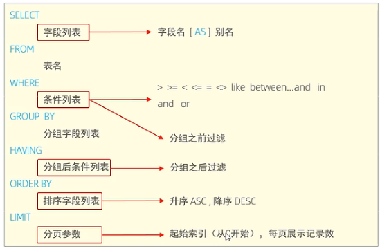

# 1、MySQL安装启动
1. MySQL启动
```
net start mysql80
net stop mysql80
```
2. MySQL客户端连接
windows自带的客户端命令行：
```
mysql -u root -p
```
3. MySQL数据模型
数据库(关系型数据库，由多张相互连接的二维表组成的数据库）和表

# 2、SQL
## 2.1 SQL通用语法
1. 可以单行或多行书写，以分号结尾
2. 可以用空格/缩进来增加语句的可读性
3. 不区分大小写，关键字建议使用大写
4. 注释
	+ 单行注释：--注释内容或#注释内容
	+ 多行注释：/\*注释内容\*/

## 2.2 SQL分类
1. DDL(Data Definition Language)：数据定义语言，用来定义数据库对象（数据库，表，字段）
2. DML(Data Manipulation Language)：数据操作语言，对数据库表中数据进行增删改
3. DQL(Data Query Language)：数据查询语言，用来查询数据库中表的记录
4. DCL(Data Control Language)：数据控制语言，用来创建数据库用户，控制数据库的访问权限

## 2.3 DDL
1. 数据库操作
	+ 查询
	查询所有数据库		
    ```mysql
    SHOW DATABASES;
	 ```
	查询当前数据库		
	```mysql
	SELECT DATABASE();
	```
	+ 创建   []表示可选择内容
	```mysql
	CREATE DATABASE [IF NOT EXISTS] 数据库名 [DEFAULT CHARSET 字符集] [COLLATE 排序规则]
	```
	字符集：utf8(三个字节)，utf8mb4(四个字节)
	+ 删除
	```mysql
	DROP DATABASE  [IF EXISTS] 数据库名;
	```
	+ 使用
	```mysql
	USE 数据库名；
	```

2. 表结构-查询
	+ 查询当前数据库所有表
	```mysql
	SHOW TABLES;
	```
	+ 查询表结构
	```mysql
	DESC 表名;
	```
	+ 查询指定表的建表语句
	```mysql
	SHOW CREATE TABLE 表名;
	```
3. 表操作-创建
    ```mysql
    CREATE TABLE 表名（
        字段1 字段1类型 [COMMENT 字段1注释],
        字段2 字段2类型 [COMMENT 字段2注释],
        ...
        字段n 字段n类型 [COMMENT 字段n注释]
    ）[COMMENT 表注释]
    ```
    注意：[...]为可选参数，最后一行字段没有","
    字段类型
    整型：int，字符串：varchar(n)，所含字符长度


4. 表操作-数据类型
	+ 数值类型
|类型|大小(byteS)|有符号(signed)范围|无符号(unsign)范围|
|--|:----:|-----------------|-----------------|
|TINYINT|1 |(-$2^{7}$,$2^{7}-1$)|(0,$2^{8}-1$)|
|SMALLINT|2 |(-$2^{15}$,$2^{15}-1$)|(0,$2^{16}-1$)|
|MEDIUMINT|3|-|-|
|INT/INTEGER|4|(-$2^{31}$,$2^{31}-1$)|(0,$2^{32}-1$)|
|BIGINT|8||(-$2^{63}$,$2^{63}-1$)|(0,$2^{64}-1$)|
|FLOAT|4|-|-|
|DOUBLE|8|-|-|
|DECIMAL|-|依赖于M(精度)和D(标度)的值|-|

123.45 M=5,D=2
SCORE DOUBLE(4,1)表示数字长度为4，小数部位为1

	+ 字符串类型
|类型|大小(byteS)|描述|
|:--:|:----:|:-----------------|
|CHAR|0-255|定长字符串|
|VARCHAR|0-65535|变长字符串|
|TINYTEXT|0-255|短文本字符串|
|TEXT|0-65 535|长文本数据|
|MEDIUMTEXT|0-16 777 215|中等长度文本数据|
|LONGTEXT|0-4 294 967 295|极大文本数据|
|TINYBLOB|0-255|不超过255个字符的二进制数据|
|BLOB|0-65 535|二进制形式的长文本数据|
|MEDIUMBLOB|0-16 777 215|二进制形式的中等长文本数据|
|LONGBLOB|0-4 294 967 295|二进制形式的极大文本数据|

CHAR(10)-->性能高，表示当前字符串能够存储的最大长度为10，VARCHAR(10)-->性能较差，最大存储长度为10，根据所存储字符串计算当前所占用的空间
char为定长，varchar为变长，当字符长度为1时，采用char存储会占用10个字节，而varchar只占用一个

	+ 日期类型
|类型|大小(byteS)|格式|描述|
|:--:|:----:|:----------|--|
|DATE|3|YYYY-MM-DD|日期值|
|TIME|3|HH:MM:SS|时间值或持续时间|
|YEAR|3|YYYY|年份值|
|DATETIME|8|YYYY-MM-DD HH:MM:SS|混合日期和时间值|
|TIMESTAMP|4|YYYY-MM-DD HH:MM:SS|混合日期和时间值，时间戳|

5. 表操作-修改
	+ **添加**字段
	```mysql
	ALTER TABLE 表名 ADD 字段名 类型(长度)[COMMENT 注释][约束];
	```
	+ **修改**数据类型
	```mysql
	ALTER TABLE 表名 MODIFY 字段名 新数据类型(长度);
	```
	+ **修改**字段名和字段类型
	```mysql
	ALTER TABLE 表名 CHANGE 旧字段名 新字段名 类型(长度)[COMMENT 注释][约束];
	```
	+ **删除**字段
	```mysql
	ALTER TABLE 表名 DROP 字段名;
	```
	+ **修改**表名
	```mysql
	ALTER TABLE 表名 RENAME TO 新表名;
	```
6. 表操作-删除
	+ 删除表
	```mysql
	DROP TABLE [IF EXISTS] 表名;
	```
	+ 删除指定表，并重新创建该表
	```mysql
	TRUNCATE TABLE 表名;
	```
### DDL总结
1. DDL-数据库操作

    ```mysql
    SHOW DATABASES;
    CREATE DATABASE 数据库名;
	USE 数据库名;
	SELECT DATABASE();
	DROP DATABASE 数据库名;
    ```
2. DDL-表操作

	```mysql
	show tables;
	CREATE TABLE 表名(字段 字段类型, 字段 字段类型);
	DESC 表名;
	SHOW CREATE TABLE 表名;
	ALTER TABLE 表名 ADD/MODIFY/CHANGE/DROP/RENAME TO ...;
	DROP TABLE 表名;
	```
## 2.3 DML：增删改
+ 添加(insert)数据
	1. 给指定字段添加数据
	```mysql
	INSERT INTO 表名 (字段1，字段2,...) values (值1,值2,...);
	```
	2. 给全部字段添加数据
	```mysql
	INSERT INTO 表名 values (值1,值2,...);
	```
	3. 批量添加
	```mysql
	INSERT INTO 表名 (字段1，字段2,...) values (值1,值2,...),(值1,值2,...);
	INSERT INTO 表名 VALUES (值1,值2,...),(值1,值2,...),(值1,值2,...);
	```
+ 修改(update)数据
	```mysql
	UPDATE 表名 SET 字段名1=值1，字段2=值2,...[WHERE 条件]
	```
	当没有where时，默认修改整张表
+ 删除(delete)数据
	```mysql
	DELETE FROM 表名 [WHERE 条件];
	```
	DELETE不能删除整个字段的值，可以使用UPDATE。不带WHERE时表示对整张表操作
## 2.5 DQL：查询
+ 查询SELECT(按照顺序编写，不可交换顺序)
	！！！执行顺序：
	
	from->where->group by->having->select->order by->limit（可由变量别名验证）
	
	```mysql
	SELECT 字段列表
	FROM 表名列表
	WHERE 条件列表
	GROUP BY 分组字段列表
	HAVING 分组后条件列表
	ORDER BY 排序字段列表
	LIMIT 分页参数
	```
	- 条件查询(where)
		1. 查询多个字段
		```mysql
		SELECT 字段1,字段2,... FROM 表名;
		SELECT * FROM 表名;
		```
		2. 设置别名(as可省略)
		```mysql
		SELECT 字段1[[AS] 别名1],字段2[[AS] 别名2],... FROM 表名;
		```
		3. 去除重复记录
		```mysql
		SELECT DISTINCT 字段列表 FROM 表名;
		```
		4. 条件查询
		```mysql
  	SELECT 字段列表 FROM 表名 WHERE 条件列表;
  	```
  	关系运算符：>,>=,<,<=,=,!=/<>，
                BETWEEN ... AND ...,
	              IN (...),
	              LIKE 占位符(模糊匹配，_匹配的单个字符，%匹配任意字符),
	              IS NULL 是空
		逻辑运算符：AND / &&, OR /||, NOT /!
		
	- 聚合函数(count,max,min,avg,sum)
		将一列数据当作一个整体，进行纵向计算
		```mysql
		SELECT 聚合函数(字段列表) FROM 表名;
		```
		$\textcolor{red}{null不参与聚合函数计算}$
		
	- 分组查询(group by)
		```mysql
		SELECT 字段列表 FROM 表名 [WHERE 条件] GROUP BY 分组字段名 [HAVING 分组后过滤条件];
		```
		where 和 having 区别
		+ 执行时机不同：where是分组之前进行过滤，不满足where条件不参数分组；而having是分组之后对结果进行过滤
		+ 判断条件不同：where不能对聚合函数进行判断，而having可以
		执行顺序：where > 聚合函数 > having
		分组之后，查询的字段一般为聚合函数和分组字段，查询其他字段无任何意义
		
	- 排序查询(order by)
		```mysql
		SELECT 字段列表 FROM 表名 ORDER BY 字段1 排序方式1,字段2 排序方式;
		```
		排序方式：ASC：升序（默认）		DESC：降序
		！！如果是多字段排序，当第一个字段值相同时，才会按照第二个字段排序
		
	- 分页查询(limit)
		```mysql
		SELECT 字段列表 FROM 表名 LIMIT 起始索引，查询记录数;
		```
		+ 起始索引从0开始，起始索引=（查询页码-1）*每页显示记录数
		
		+ 分页查询时数据库的方言，不同数据库由不同的实现
		
		+ 如果查询的时第一页，起始索引可以省略，直接简写为limit 10。（10条记录数）
		
		  
### 查询总结


## 2.6 DCL
+ 用户管理
    1. 查询用户
        ```mysql
        USE mysql;
        SELECT * FROM user;
        ```
    2. 创建用户
        ```mysql
        CREATE USER '用户名'@'主机名' IDENTIFIED BY '密码';
        ```
    3. 修改用户密码
        ```mysql
        ALTER USER '用户名'@'主机名' IDENTIFIED WITH mysql_native_password BY '新密码';
        ```
    4. 删除用户
        ```mysql
        DROP USER '用户名'@'主机名';
        ```
        主机名可以使用%通配（表示任意主机）
        开发人员操作较少，主要是DBA（database administrator 数据库管理员使用)
+ 权限控制
    1. 查询权限
        ```mysql
        SHOW GRANTS FOR '用户名'@'主机名';
        ```
    2. 授予权限
        ```mysql
        GRANT 权限列表 ON 数据库名.表名 TO '用户名'@'主机名';
        ```
    3. 撤销权限
        ```mysql
        REVOKE 权限列表 ON 数据库名.表名 FROM '用户名'@'主机名';
        ```
        多个权限之间，使用逗号分隔
        授权时，数据库名和表名可以使用*进行通配，代表所有
        e.g.,对用户赋予所有数据库中所有表的所有权限
    ```mysql
    grant all on *.* to 'xyf'@'%'
    ```
	|权限列表|说明|
	|:-:|:-|
	|ALL,ALL PRIVILEGES|所有权限|
	|SELECT|查询数据|
	|INSERT|插入数据|
	|UPDATE|插入数据|
	|DELETE|修改数据|
	|ALTER|修改表|
	|DROP|删除数据库/表/视图|
	|CREATE|创建数据库/表|