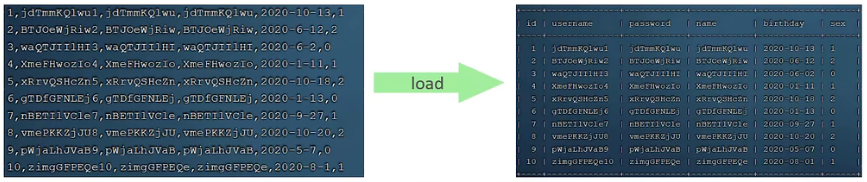
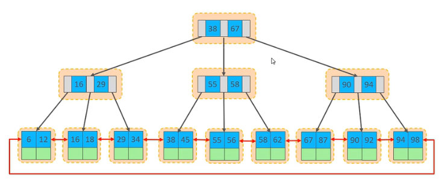
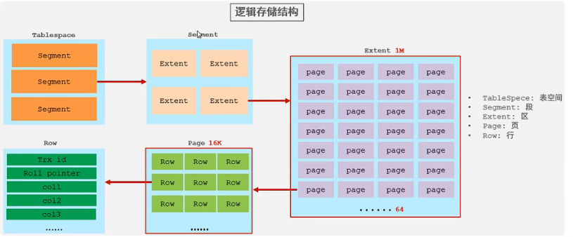
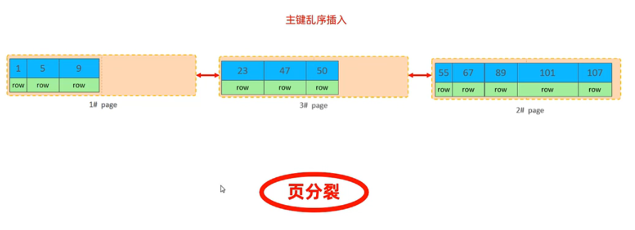
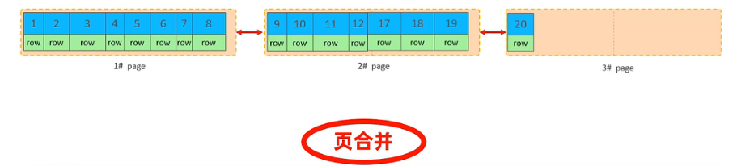
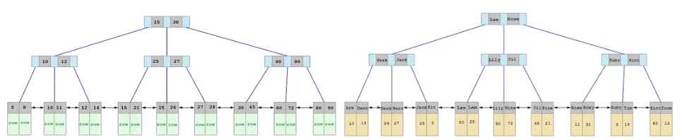
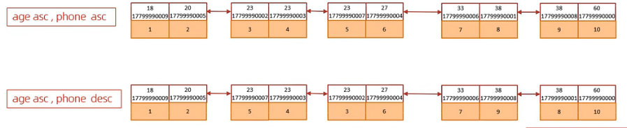
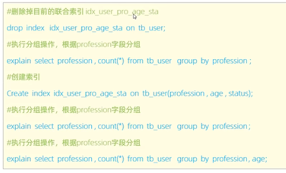
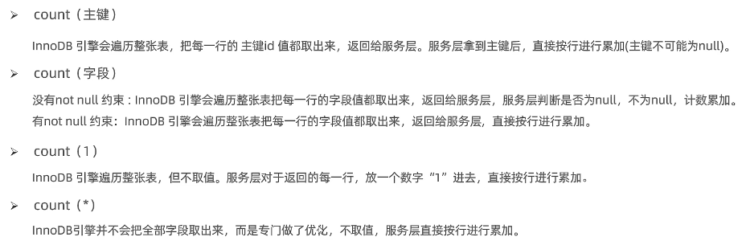
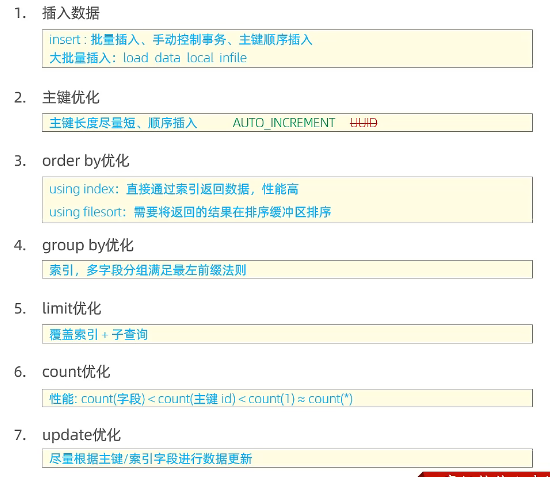

截图软件 snipaste

# 1. SQL优化

## 1.1 插入数据
+ 批量插入
一次500-1000条
```mysql 
insert into tb_name values (1,'Toms'),(2,'Cat'),(3,'Jerry');
```
+ 手动提交事务
```mysql 
start transaction;
insert into tb_name values (1,'Toms'),(2,'Cat'),(3,'Jerry');
insert into tb_name values (4,'Toms'),(5,'Cat'),(6,'Jerry');
commit;
```
+ 主键顺序插入：$\textcolor{red}{主键顺序插入性能高于乱序插入}$
主键顺序插入：1,2,3,4,5，6,7,8,9,14,25,36
主键乱序插入：8,1,7,3,88,34,2,5,76,34,56

1. 大批量插入数据
如果一次性需要插入大批量数据，使用insert插入性能较低，此时可以使用MySQL数据库提供的load指令进行插入
2. 

```mysql
# 客户端连接服务端时，加上参数 --local-infile
mysql --local-infile -u root -p
# 设置全局参数local_infile 为1，开启从本地加载文件导入数据的开关
set global local_infile=1;
# 执行load指令将准备好的数据，加载到表结构中，'/root/sql1.log'为文件的存储地址
load data local infile '/root/sql1.log' into table 'tb_user' fields terminated by ',' lines terminated by '\n';
```
## 1.2 主键优化

+ 数据组织方式

  在InnoDB存储引擎中，表数据都是根据主键顺序组织存放的，这种存储方式的表成为$\textcolor{red}{"索引组织表"}$(index organized table$\textcolor{red}{IOT}$)

  

  

  Page为最小存储单位，其中的row存储的为字段值

+ 页分裂
  页可以为空，可以填充一半，或者100%，每个页包含了2-N行数据（如果一行数据过大，会行溢出），根据主键排列

  

+ 页合并

  当删除一行记录时，实际上记录并没有被物理删除，只是记录被标记为删除并且它的空间变得允许被其他记录声明使用。

  当页中删除的记录达到MERGE_THRESHOLD（默认为页的50%），InnoDB会开始寻找最近的页（前或后）看看是否可以将两个页合并以优化空间使用。

  

  ==MERGE_THRESHOLD：合并页的阈值，可以自己设置，在创建表或者创建索引时指定==
  
+ 主键设计原则

  + 满足业务需求下，尽量**降低主键的长度**

  + 插入数据时，尽量选择**顺序插入**，选择使用**AUTO_INCREMENT**自增主键

  + 尽量不使用UUID(无序)做主键或者其他自然主键，如身份证号

  + 业务操作时，避免对主键的修改

  
## 1.3 order by优化
+ Using filesort：通过==表的索引或全表索引==，读取满足条件的数据行，然后**在排序缓冲区sort buffer中完成排序操作**，所有不是通过索引直接返回排序结果的排序都叫FileSort
+ Using index：通过==有序索引顺序==扫描直接返回有序索引，这种情况即为using index，不需要额外排序，操作效率高
  + **根据排序字段建立合适的索引，多字段排序时，也遵循最左前缀法则**
  + **尽量使用覆盖索引**
  + **多字段排序时，一个升序，一个降序，此时需要注意联合索引在创建时的规则（ASC/DESC)**
  + **如果不可避免的出现filesort，大数据量排序时，可以适当增大排序缓冲区大小sort_buffer_size**


```MYSQL
SHOW VARIABLES LIKE "sort_buffer_size"; #默认为256k，如果超过该大小则会动用磁盘文件
```

```mysql
#创建索引，排序默认为ASC
create index idx_uer_age_pho_ad on table_user(age， phone);

# 创建索引后，根据age,phone进行升序排列，降序排列，采用using index
explain select id,age,phone from tb_user order by age，phone;
explain select id,age,phone from tb_user order by age desc，phone desc;
# 不满足最左前缀，order by中有顺序规定，查询时没有 会额外使用using filesort
explain select id,age,phone from tb_user order by phone,age;
# Using temporary：采用临时表，效率低
# 根据age，phone一个降序，一个升序，会额外使用using filesort
explain select id,age,phone from tb_user order by age asc，phone desc;
# 索引中排序默认为ASC，可以在创建索引时指定排序方法
create index idx_uer_age_pho_ad on table_user(age asc, phone desc)
```
  
## 1.4 group by优化

采用group by时，只有对分组字段以及聚合函数查询才有意义

+ 在分组操作时，可以**根据索引来提高效率**
+ 分组操作时，索引的使用也满足**最左前缀法则**

  

创建索引后，以上查询均为using index

```mysql
# using tenporary 以及using index
explain select age,count(*) from tb_user groupy by age;

# only using index ，满足最左前缀法则
explain select age,count(*) from tb_user where profession="化工" groupy by age;
```

## 1.5 limit 优化

常见且耗时的问题是limit 2000000,10，此时MySQL排序前2000010记录，仅仅返回2000000-2000010的记录，其他记录丢弃，查询代价非常大

优化思路，一般分页查询，通过**创建覆盖索引**能够较好地提高性能，可以通过**覆盖索引加子查询**形式进行优化

```mysql
explain select t.* from tb_sku t,(select id from tb_sku order by id limit 2000000,10) a where t.id=a.id

# 如果采用子查询，不允许子查询中有limit关键字，!!!下面做法错误
explain select * from tb_sku where id in (select id from tb_sku order by id limit 2000000,10) 
```

## 1.6 count 优化

```mysql
select count(*) from tb_user;
```

+ MyISAM引擎把一个表的总行数存在了磁盘上，因此执行count(*)时会直接返回个数，效率很高，但不支持where条件查询

+ InnoDB引擎更加麻烦，执行count(*)时，需要把数据一行一行地从引擎里读出来，然后积累计数

==优化思路：自己计数==

+ count的几种用法
  + count()为聚合函数，对于返回的结果集，一行行地判断，如果count函数的参数不是NULL，累计值就加1，否则不加，最后返回累计值
  
  + 用法：count(*)、count(主键)、count(字段)、count(1)
    
  
  $\textcolor{red}{按照效率排序：count(字段)<count(主键 id)<count(1)约等于count(*)，尽量使用count(*)}$
  

## 1.7 update优化

```mysql
update student set no='200000' wehre id=1;  # 执行的为行锁。支持并发性
update student set no='200001' where name="Jerry"; #没有对name建立索引时，为表锁,并行 事务无法修改表，建立索引后为行锁，支持事务并发性
```

$\textcolor{red}{InnoDB的行锁是针对索引加的锁，不是针对记录加的锁，并且该索引不能失效，否则会从行锁升级为表锁}$

## 1.8 总结
  

# 2. 视图/存储过程/触发器

## 2.1 视图

试图(view)是一种虚拟存在的表。视图中的数据并不在数据库中实际存在，行和列数据来自定义视图的查询中使用的表，并且是在使用视图中动态生成的。

视图只保存了查询的SQL逻辑，不保存查询结果。因此在创建视图的时候，主要工作在于创建这条SQL的查询语句上。

+ 创建

```mysql
create [or replace] view 视图名称[(列表列名)] as select 语句 [WITH [CASCADED | LOCAL] CHECK OPTION]
```

+ 查询

1.  查看创建视图语句：
```mysql
show create view 视图名称;
```
2.  查看视图数据：

```mysql
select * from 视图名称...;
```

+ 修改

```mysql
# 方式一
create [or replace] view 视图名称[(列名列表)] as select 语句 [WITH [CASCADED | LOCAL] CHECK OPTION]
# 方式二
alter view 视图名称[(列名列表)] as select 语句 [WITH [CASCADED | LOCAL] CHECK OPTION]
```

+ 删除

```mysql
drop view [if exists] 视图名称;
```
+ 视图的检查选项
  1. **with check option**子句创建视图，MySQL会通过视图检查正在更改的每个行，例如 插入，更新，删除，以使其符合视图的定义。 MySQL运行基于另一个视图创建视图，它会检查依赖视图中的规则以保持一致性。为了确定检查的范围，mysql提供了两个选项：CASCADED和LOCAL，默认值为cascaded（集连）

```mysql
# 增删改时，没有with check option，不会检查选项
create view v1 select id, name from tb_stu where id <=20;

#  增删改时，with cascaded check option会检查当前视图所以来的所有视图，是否满足约束条件
create view v2 select id, name from tb_stu where id >=10 with cascaded check option;
```
  

增删改时，v1不会检查选项（约束条件）

v2是基于v1，且含有with cascaded check option，会连带v1一起检查约束条件，

v3是基于v2的，v3本身不会检查，但是由于v2，会连带v1一起检查选项

  2. **with local check option：**仅仅看本身是否带有with check option，有则检查，没有则不检查


+ 视图更新

  要使视图可更新，视图中的行与基础表中的行之间必须存在一对一的关系，如果视图包含以下任何一项，则该视图不可更新：

  1. 聚合函数或窗口函数（sum()、min()、max()、count()等）
  2. DISTINCT
  3. GROUP BY
  4. HAVING 
  5. UNION 或UNION ALL

```mysql
create view stu_v_count as select count(*) from student;
# 视图中数据与表中数据并非一一对应，则以下插入不成功
insert into stu_v_count values (9);
```

+ 作用
  + 简单：经常被使用的查询可以被定义为视图，使得用户不必为以后的操作每次指定全部的条件
  + 安全：数据库可以授权，但不能授权到数据库特点行和特定列上，通过视图用户只能查询和修改他们所能见到的数据
  + 数据独立：可以帮助用户屏蔽真实表结构变化带来的影响


## 2.2 存储过程

+ 介绍


+ 特点：
  + 封装，复用
  + 可以接收参数，也可以返回数据
  + 减少网络交互，效率提升
+ 创建

```mysql
create procedure 存储过程名称([参数列表])
begin
		SQL语句
end;
```
+ 调用
```mysql
call 名称([参数列表]);
```
+ 查看
```mysql
# 查询指定数据库的存储过程及状态信息
select * from information_schema.routines where routine_schema='xxx';

# 查询某个存储过程的创建
show create procedure 存储过程名称 ;

# 删除
drop procedure [if exists] 存储过程名称;

# 命令行使用时，可以通过delimiter $$#设置sql语句的结束
```
$\textcolor{red}{在命令行中，执行创建存储过程的SQL时，需要通过关键字delimiter指定SQL语句的结束符（默认为;）}$

## 2.2.1 变量

$\textcolor{red}{系统变量}$是MySQL服务器提供，不是用户定义的，分为$\textcolor{red}{全局变量，会话变量}$

+ 查看系统变量

```mysql
SHOW [SESSION|GLOBAL] VARIABLES;
SHOW [SESSION|GLOBAL] VARIABLES LIKE 'auto%'; #模糊匹配查看系统变量
select @@[session|global].autocommit; #准确查询某个变量,自动提交是否打开
```

+ 设置系统变量

```mysql
SET [SESSION|GLOBAL] 系统变量名=值；
set @@[session|global].系统变量=值;
```
$\textcolor{red}{注意：}$
如果没有指定session|global，**默认是session，会话变量**。
mysql服务器**重启之后，所设置的全局参数会失效**，要想不失效，可以在/etc/my.cnf中配置

+ ==自定义变量==

  用户定义变量是用户根据需要自定义的变量，用户变量不用提前声明，在用的时候直接’@变量名'使用即可。作用域为当前链接

```mysql
########### 赋值
set @var_name = expr[, @var_name=expr]...; #var——char为自定义变量名
set @var_name := expr[, @var_name=expr]...; #推荐“：=”，与“=”比较运算符区分

select @var_name := expr[, @var_name=expr]...;
select 字段名 into @var_name from 表名; #将表的查询结果赋值给var_name

############ 使用
select @var_name[, @var_name=expr]...;
```
$\textcolor{red}{注意：}$
  $\textcolor{red}{用户定义的变量无需对其进行声明或初始化，只不过获取到的值为NULL}$

+ ==局部变量==

  根据需要定义在局部生效的变量，访问之前，需要declare声明。可用作存储过程内的局部变量和输入参数，局部变量的范围是在其内声明的begin ... end块

```mysql
####### 声明
declare 变量名,变量类型 [default value];
## 变量类型就是数据库字段类型，char, varchar,int,bigint,date,time

####### 赋值
set 变量名=值;
set 变量名:=值;
select 字段名 into 变量名 from 表名;
```

### 2.2.1 if条件

```mysql
IF 条件1 THEN
	...
ELSEIF 条件2 THEN     #--可选
	...
ELSE 				 #--可选
	...
END IF;
```
案例：根据定义的分数score变量，判定当前分数对应的分数等级
score >= 85，等级为优秀， score >= 60，且< 85等级为及格，score<60为不及格
```mysql
create procedure p1()
begin
	declare score int default 65; #定义局部变量
	declare result varchar(10);
	if score>=85 then
		set result := '优秀';  #赋值
	elseif score >= 60 then
		set result := "及格";
	else
		set result:='不及格';
	select result;
	end if;
end;

call p1();
```

### 2.2.2 参数


用法：此前注意用delimiter将结束符改为$$

```mysql
create procedure 存储过程名称([in/out/inout 参数名 参数类型])
begin
		SQL语句
end;

#########  对上面案例进行改进，将score作为输入，result作为输出
create procedure p2(in score int, out result varchhar(10))
begin
	if score>=85 then
		set result := '优秀';  #赋值
	elseif score >= 60 then
		set result := "及格";
	else
		set result:='不及格';
	end if;
end;
call p2(score: 68, result:@result); #result为用户自定义变量
select @result; #查看结果

############# 将200分制换score算成百分制
create procedure p3(inout score double)
begin
	set score:=score*0.5;
end;
set @score = 120;
call p3(score:@score);
select @score;
```

+ case

```mysql
###### 语法一
CASE case_value
WHEN when_value1 Then statement_list1;
[WHEN when_value2 Then statement_list2]...;
[ELSE statement_list];
END CASE;


####### 语法2
CASE
WHEN search_condition1 THEN statement_list1;
[WHEN search_condition2 THEN statement_list2]...
[else statement_list]
CASE END;
```

+ while
有条件的循环控制语句，满足条件进行循环操作
```mysql
# 先判定条件，如果条件为true，则执行逻辑，否则不执行
while 条件 do
SQL逻辑
end while;
```

+ repeat
有条件的循环控制语句，满足条件后退出循环
```mysql
REPEAT 
	SQL逻辑
	UNTIL 条件
end repeat;
```
+ loop
	实现简单循环，如果不再SQL逻辑中增加退出循环的条件，可以用其来实现简单的死循环，loop可以配合以下两个语句使用：
	1. leave :配合循环使用，退出循环
	2. iterate：必须用在循环中，作用是跳过当前循环剩下的语句，直接进入下一次循环
```mysql
[begin_label:] LOOP
	SQL逻辑
END LOOP [END_LABEL];

LEAVE label; #退出指定标记的循环体
ITERATE label; #直接进入下一次循环
```
+ ==游标==

$\textcolor{red}{游标}$(cursor)用来存储查询结果集的数据类型，在存储过程和函数中可以使用游标来对结果集进行循环的处理。游标的使用包括游标的声明，OPEN、FETCH和CLOSE
```mysql
# 声明游标
DECLARE 游标名称 CURSOR FOR 查询语句;

# 打开游标
OPEN 游标名称;

# 获取游标记录
fetch 游标名称 into 变量[,变量];

# 关闭游标
CLOSE 游标;
```
+ 条件处理程序
$\textcolor{red}{条件处理程序}$(handler)可以用来定义流程控制结构执行过程中遇到问题时相应的处理步骤
```mysql
DECLARE handler_action HANDLER FOR condition_value [,condition_value]... statement;

handler_action
	CONTINUE:  # 继续执行当前程序
	EXIT:   #终止执行当前程序
condition_value
	SQLSTATE sqlstate_value: # 状态码， 如0200
	SQLWARNING: # 所有以01开头的sqlstate代码的简写
	NOT FOUND:  # 所有以02开头的sqlstate代码的简写
	SQLEXCEPTION: # 所有没有被sqlwarning或not found 捕获的sqlstate代码的简写
```
案例：根据表emp中返回age小于n的name，salary
```mysql
create procedure p8(in uage int)
begin
    # 先声明变量，后声明游标
    declare uname varchar(10);
    declare usalart int;
    #声明游标
    declare u_cursor cursor for select name,salary from emp where age<=uage;
    # 声明条件处理程序，while true中捕捉到异常时执行该退出，02000表示没有数据
    declare exit handler for not found CLOSE u_cursor;

    #创建表结构
    drop table if exists tb_user_sal;
    create table if not exists tb_user_sal(
        id int primary key auto_increment,
        name varchar(10),
        salary int
    );
    # 打开游标
    open u_cursor;
    # 循环获取游标中的数据,一直进行循环
    while true do
        # 将游标中数据传入变量中
        fetch u_cursor into uname, usalart;
        insert into tb_user_sal values(null, uname, usalart);
    end while;
    close u_cursor;
end;
```

## 2.3 存储函数

存储函数是有$\textcolor{red}{返回值}$的存储过程，存储函数的参数只能是$\textcolor{red}{IN}$类型

```mysql
CREATE FUNCTION 存储函数名称([参数列表])
RETURNS type [characteristic...]
BEGIN 
	SQL语句
END;
```


characteristic 说明

1. DETERMINISTIC： 相同的输入参数总是产生相同的结果
2. NO SQL：不包含SQL语句
3. READS SQL DATA：包含读取数据的语句，但不包含写入数据的语句

# 2.4 触发器

$\textcolor{red}{触发器(trigger)}$是与表有关的数据结构，指在insert/update/delete**之前或之后**，出发并执行触发器中定义的SQL语句集合。触发器的这种特性可以协助应用在数据库端确保数据的完整性，日志记录，数据校验等。

使用==别名OLD和NEW==来引用触发器中发生变化的记录内容，这与其他数据库是相似的，现在触发器还只支持**行级触发**（修改n行则触发n行），不支持语句级触发

  

+ 语法

  + 创建

    ```mysql
    create TRIGGER tigger_name
    BEFORE/AFTER INSERT/UPDATE/DELETE
    ON tbl_name FOR EACH ROW # 行级触发器
    BEGIN
    	trigger_stmt
    END;
    ```

  + 查看

    ```MYSQL
    SHOW TRIGGERS;
    ```

  + 删除

    ```MYSQL
    DROP TIGGER [schema_name.]trigger_name; #如果没有指定schema_name，默认为当前数据库
    ```

  + 案例：通过触发器记录user表的数据变更日志（user_logs),包含增加，修改，删除；

    ```mysql
    # 日志表
    create table user_logs(
    	id int(11) not null auto_increment,
        operation varchar(20) not null comment"操作类型，insert/update/delete",
        operate_time datetime not null comment "操作时间",
        operate_id int (11) not null comment "操作ID",
        operate_params varchar(500) comment"操作参数",
        primary key(id)
    )engine=Innodb default charset=utf8;
    
    # 定义插入数据触发器，插入之后触发
    create trigger tb_user_insert_trigger after insert on tb_user for each row
    begin
    	insert into user_logs(id,operation,operate_time,operate_id,operate_params) values
        (null,'insert',now(),new.id, concat('插入的数据内容：id=',new.id,'name=',new.name,'phone=',new.phone,'email=',new.email,'profession=',new.profession))
    end;
    
    # 查看触发器
    show triggers;
    
    # 定义修改数据触发器，update之后触发
    create trigger tb_user_update_trigger after update on tb_user for each row
    begin
    	insert into user_logs(id,operation,operate_time,operate_id,operate_params) values
        (null,'insert',now(),new.id, concat('更新之前的数据内容：id=',old.id,'name=',old.name,'phone=',old.phone,'email=',old.email,'profession=',old.profession,'|更新之后的数据内容：id=',new.id,'name=',new.name,'phone=',new.phone,'email=',new.email,'profession=',new.profession))
    end;
    
    # 定义删除数据触发器，删除之后触发
    create trigger tb_user_delete_trigger after delete on tb_user for each row
    begin
    	insert into user_logs(id,operation,operate_time,operate_id,operate_params) values
        (null,'insert',now(),old.id, concat('删除之前的数据内容：id=',old.id,'name=',old.name,'phone=',old.phone,'email=',old.email,'profession=',old.profession))
    end;
    ```


