# 1. 函数
**函数**是一段可以直接被另一段程序调用的程序或代码
**语法**
```mysql
select 函数(参数);
```
## 1.1 字符串函数
|函数|功能|
|--|--|
|concat(s1,s2,...,sn)|字符串拼接|
|lower(str)|字符串全部转为小写|
|upper(str)|字符串全部转为大写|
|LPAD(str,n,pad)|左填充，用字符串pad对str的左边进行填充，达到n个字符串长度|
|RPAD(str,n,pad)|右填充，用字符串pad对str的左边进行填充，达到n个字符串长度|
|TRIM(str)|去掉字符串头部和尾部的空格|
|SUBSTRING(str,start,len)|返回从字符串str的start位置起的len个长度的字符串|

## 1.2 数值函数
|函数|功能|
|--|--|
|CEIL(x)|向上取整|
|FLOOR(x)|向下取整|
|MOD(x,y)|返回x/y的模|
|RAND(x)|返回0-1内的随机数|
|ROUND(x,y)|求参数x的四舍五入值，保留y位小数|

## 1.3 日期函数
|函数|功能|
|--|--|
|CURDATE()|返回当前日期|
|CURTIME()|返回当前时间|
|NOW()|返回当前日期和时间|
|YEAR(date)|获取指定date的年份|
|MONTH(date)|获取指定date的年份|
|DAY(date)|获取指定date的年份|
|DATE_ADD(date, INTERVAL expr type)|返回一个日期/时间值加上一个时间间隔expr后的时间值|
|DATEDIFF(date1,date2)|返回起始时间date1和结束时间date2之间的天数,date1-date2|

e.g.，当前时间往后推70年，70天，两个时间之间的间隔
```mysql
select date_add(now(),INTERVAL 70 year)
select date_add(now(),INTERVAL 70 day)
select datadiff('2021-10-01','2021-12-01')
```
## 1.4 流程函数
|函数|功能|
|--|--|
|IF(value, t,f)|如果value为true，则返回t，否则返回f|
|IFNULL(value1,value2)|如果value不为空，返回value1，否则返回value2|
|CASE WHEN [val1] THEN [res1] ... ELSE [default] END|如果val1为true，返回res1，...，否则返回default默认值|
|CASE [expr] WHEN [val1] THEN [res1] ... ELSE [default] END|如果expr为val1，返回res1，...，否则返回default默认值|

e,g,  
```mysql
select ifnull('','Default') //返回''
select ifnull(null,'Default') //返回'Default'

#/查询employee表中员工姓名和工作地址（北京、上海--->一线城市，其他--->二线城市)
select 
    name,
    (case workaddress when '北京' then '一线城市' 
    	when '上海' then '一线城市' else '二线城市' end) as '工作地址' 
from employee;

#查询学号，姓名，成绩优秀等级（score>=80--->优秀，score>=60--->及格，其他不及格
select 
    id,name,
    (case when math>=80 then '优秀' 
    	when math>=60 then '及格' else '不及格' end) '数学'
from score;
```

# 2. 约束
## 2.1  概述
+ 概念：约束是作用于表中的字段上的规则，用于限制存储在表中的数据
+ 目的：保证数据库中数据的正确、有效、完整性
+ 分类
|约束|描述|关键字|
|--|:--|--|
|非空约束|限制该字段的数据不能为null|NOT NULL|
|唯一约束|保证该字段的所有数据都是唯一、不重复的|UNIQUE|
|主键约束|一行数据的唯一标识，要求非空且唯一|PRIMARY KEY|
|默认约束|保存数据时，如果未指定该字段的值，则采用默认值|DEFAULT|
|检查约束|保证字段值满足某一条件|CHECK|
|外键约束|用来让两张表的数据之间建立连接，保证数据的一致性和完整性|FOREIGN KEY|

！！！
约束是作用于表中字段上的，可以在创建表/修改表的时候添加约束

```mysql
########## 建表完成之后添加约束
# 主键约束
alter table 表名 add primary key(字段);
# 非空约束
alter table 表名 modify 字段 数据类型 not null;
# 自动增长
alter table 表名 modify 字段 数据类型 auto_increment;
alter table 表名 modify 字段 数据类型;
#6.默认值
添加:alter table table_name alter 列名  set default '值'
删除:alter table table_name alter 列名  drop default
```


## 2.2 约束显示
- id：主键，并且自动增长-->PRIMARY KEY,AUTO_INCREMENT
- name:不为空，并且唯一-->NOT NULL , UNIQUE
- age：大于0，且小于等于120-->CHECK
- status：没有指定该值，默认为1-->DEFAULT

```mysql
create table user(
		id int primary key auto_increment comment 'ID唯一标识',
		name varchar(10) not null unique comment '姓名',
		age int check (age>0 and age <120) comment '年龄',
		status char(1) defalut '1' comment '状态',
		gender char(1) comment '姓名'
) comment '用户名'
```
多个关键字之间用空格隔开


## 2.3 外键约束
- 外键用来让两张表的数据之间建立链接，从而保证数据的一致性和完整性
- 外键所关联的为父表，外键存在于字表中
  1. 从表中删除记录不会对主表造成影响。（从删主不删）
- 外键创建规则
  1. 必须有主表才可以设置从表
  2. 主表必须实际存在
  3. 必须为主表定义主键
  4. 外键列的数据类型必须和主键列的数据类型相同
  5. 外键列的数量必须和主键列的数量相同
  6. 外键可以不是外表中的主键，但必须和主表关联字段相对应

添加外键
```mysql
CREATE TABLE 表名(
	字段名 数据类型,
	...
	constraint [外键名称] FOREIGN KEY (外键字段名) REFERENCES 主表(主表字段名)
)

ALTER TABLE 表名 ADD CONSTRAINT 外键名称 FOREIGN KEY (外键字段名) REFERENCES 主表(主表字段名);
```

删除外键
```mysql
ALTER TABLE 表名 DROP FOREIGN KEY 外键名称 ;
```

- 删除/更新行为

|行为|说明|
|:--:|--|
|NO ACTION|当父表中删除/更新对应记录时，首先检查该记录是否有对应外键，如果有则不允许删除/更新。（与RESTRICT一致）|
|RESTRICT|当父表中删除/更新对应记录时，首先检查该记录是否有对应外键，如果有则不允许删除/更新。（与NO ACTION一致）|
|CASCADE|当父表中删除/更新对应记录时，首先检查该记录是否有对应外键，如果有，则也删除/更新外键在字表中的记录|
|SET NULL|当父表中删除对应记录时，首先检查该记录是否有对应外键，如果有则设置子表中该外键值为null（这要求该外键字段允许取null|
|SET DEFAULT|父表有变更时，子表将外键列设置成一个默认的值（Innodb不支持）|


在输入输出上设置行为均为CASCADE
```mysql
ALTER TABLE 表名 ADD CONSTRAINT 外键名称 FOREIGN KEY (外键字段名) REFERENCES 主表(主表字段名) ON UPDATE CASCADE ON DELETE CASCADE;
```
在输入输出上设置行为均为set null
```mysql
ALTER TABLE 表名 ADD CONSTRAINT 外键名称 FOREIGN KEY (外键字段名) REFERENCES 主表(主表字段名) ON UPDATE SET NULL ON DELETE SET NULL;
```
# 3. 多表查询
## 3.1 多表关系
表结构之间的关系分为三种
  1. 一对多（多对一）
	+ 例如：部门与员工，一个部门对应多个员工
	
	+ **在多的一方建立外键，指向一的一方的主键**
	
	  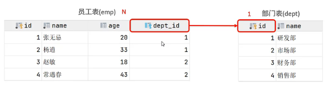
	
```mysql
#在dept存在的情况下创建emp
create table emp(
id int anto_increment primari key,
name varchar(10) not null unique,
age tinyint check (age>0 and age <120) comment '年龄',
dept_id int not null,
constraint fk_emp_dept_id foreign key (dept_id) references dept(id)
);
```
  2. 多对多
	+ 例如：学生与课程，一个学生可选多门课，多门课也可由多个学生选择
	+ **建立第三张表，中间表至少包含两个外键，分别关联两方主键**
	语法
```mysql
#学生表创建
create table student(
id int auto_increment primary key comment "主键id",
name varchar(10) comment "姓名",
no varchar(10) comment "学号",
) comment "学生表";

#课程表创建
create table crouse(
id int auto_increment primary key comment "主键id",
name varchar(10) comment "课程名称",
) comment "课程表";

#创建连接表
create table student_crouse(
id int auto_increment primary key comment "主键",
studentid int not null comment "学生id"，
crouseid int not null comment "课程id"，
constraint fk_studentid foreign key (student_id) references student(id),
constraint fk_crouseid foreign key (crouse_id) references crouse(id),
) comment "学生课程中间表"
```
  3. 一对一
	+ 例如：用户与用户详情，用于单表拆分，将一张表的基础字段放在一张表中，其他详情放到另一张表中，以提高效率
	
	+ **在任意一方加入外键，关联另一方的主键，并设置外键为唯一的(UNIQUE)**
	
	  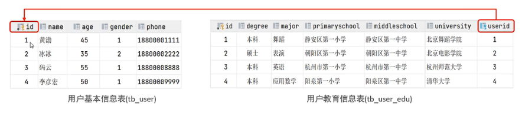

```mysql
#学生基本信息创建
create table student(
id int auto_increment primary key comment "主键id",
name varchar(10) comment "姓名",
no varchar(10) comment "学号",
) comment "学生表";
#学生详细信息表
create table stu_user_edu(
id int auto_increment primary key comment "主键id",
major varchar(50) comment "学历"
...
userid int unique comment "用户id",
constraint fk_userid foreign key (userid) references student(id);
) comment "用户教育信息表"
```
## 3.2 多表查询概述
语法

在多表查询时，需要消除无效笛卡尔积(A，B集合的所有组合情况 )
```mysql
select * from emp,dept where emp.dept_id = dept.id;
```
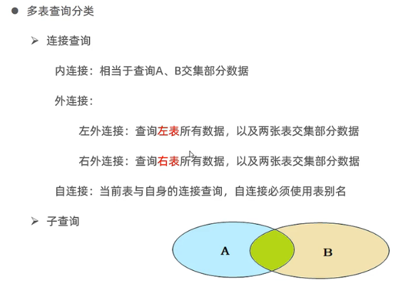

### 3.2.1 内连接
**内连接查询的是两张表交集的部分**
+ 隐式内连接
```mysql
select 字段列表 from 表1,表2 where 条件;
```
+ 显示内连接
```mysql
select 字段列表 from 表1 [INNER] JOIN 表2 ON 连接条件;
```

e.g.
```mysql
#隐式内连接，查询每一个员工的姓名，以及关联的部门名称
select emp.name,dept.name from emp,dept where emp.dept_id = dept.id;
#给表起别名，不能在where处用原名了，用于简化操作
select e.name,d.name from emp e,dept d where e.dept_id = d.id;

#显示内连接
select e.name == d.name from emp e inner join dept d on e.dept_id = d.id
```
### 3.2.2 外连接
+ 左外连接，**查询表1（左表）的所有数据，包含表1表2交集部分的数据**
```mysql
select 字段列表 from 表1 LEFT [OUTER] JOIN 表2 ON 条件;
```
+ 右外连接，**查询表2（右表）的所有数据，包含表1表2交集部分的数据**
```mysql
select 字段列表 from 表1 RIGHT [OUTER] JOIN 表2 ON 条件;
```
e.g.
```mysql
#左外连接：查询emp的所有数据，和对应的部门名称
select e.*, d.name from emp e left outer join dept p on e.dept_id=d.id;

#右外连接：查询dept的所有数据，和对应的员工信息
select d.*,e.* from emp e right join dept p on e.dept_id=d.id;

#右外-》左外，与上面表示相同意义
select d.*,e.* from dept p left join emp e  on e.dept_id=d.id;
```

### 3.2.3 自连接
**可以是内连接查询，也可以是外连接查询**
```mysql
select 字段列表 from 表A 别名A JOIN 表A 别名B ON 条件;
```
e.g.，表必须取别名
```mysql
#内连接：查询员工 及其 所属领导姓名
select e1.name,e2.name from emp e1 join emp e2 on e1.managerid = e2.id;

#外连接：查询所有员工emp 及其领导的姓名 emp，如果员工没有领导，也要查询出来
select e1.name,e2.name from emp e1 left join emp e2 on e1.managerid = e2.id;
```
### 3.2.4 联合查询-union
关键字：UNION(合并并去重)，UNION ALL(仅合并)
把多次查询的结果合并起来，形成一个新的查询结果集
```mysql
SELECT 字段列表 FROM 表A ...
UNION [ALL]
SELECT 字段列表 FROM 表B ...;
```
**对于联合查询的多张表的列表必须保持一致，字段类型也需要保持一致
union all会将全部数据合并在一起，union会对合并之后的数据去重**
e.g.
```mysql
#薪资低于5000的员工， 和 年龄大于 50 的员工全部查询出来
#想要合并后去重，去掉all
select * from emp where salary<5000 
union all
select * from emp where age > 50;

# 以下做法错误，不满足表格式一致
select * from emp where salary<5000 
union all
select name from emp where age > 50;
```
## 3.4 子查询
SQL语句中嵌套SELECT语句，称为**嵌套查询（子查询）**
```mysql
SELECT * FROM t1 WHERE column1=(SELECT column1 FROM t2)
```
**子查询外部的语句可以使INSERT/UPDATE/DELETE/SELECT中的任意一个**
+ 根据子查询结果不同，可分为
1. 标量子查询
    （子查询结果为单个值(数字，字符串，日期等)）
    常用操作符： > ,>=,<,<= ,=,<>(不等于)

e.g.
```mysql
#查询“销售部”的所有员工
select id from dept where name="销售部";
select * from emp where dept_id = id;
#结合起来
select * from emp where dept_id = (select id from dept where name="销售部");

#查询在“东方白”入职之后的员工信息
select entryname from emp where name="东方白";
select * from emp where entryname > "2009-12-09";
#结合起来
select * from emp where entryname > (select entryname from emp where name="东方白");
```

2. 列子查询
    （子查询结果为一列（可以为多行））
    常用操作符：IN, NOT IN, ANY, SOME, ALL

|操作符|描述|
|:--:|---|
|IN|在指定的集合范围之内，多选一|
|NOT IN|不在指定的集合范围之内|
|ANY|子查询返回列表中，有任意一个满足即可|
|SOME|与ANY等同，使用SOME的地方都可以使用ANY|
|ALL|子查询返回的列表值都必须满足|

e.g.
```mysql
#查询“销售部”和“市场部”的所有员工
select id from dept where name="销售部" or name="市场部";#得到（2,4）
selct * from emp where dept_id in (2,4);
########结合
selct * from emp where dept_id in (select id from dept where name="销售部" or name="市场部");

#查询比财务部所有人的工资都高的员工信息
#1.从dept表中查询财务部id
select id from dept where name="财务部";#得到3
#2.获取财务部所有人的薪水, 可以用max获取最大薪资
select salary from emp where dept_id = 3;#返回1000,2000,3000
#3.比所有薪水都高的员工
select * from emp where salary > all(1000,2000,3000);
########结合
select * from emp where salary > all(select salary from emp where dept_id = (select id from dept where name="财务部"))
```
3. 行子查询
（子查询结果为一行（可以为多列））
常用操作符：IN, NOT IN, ANY, SOME, ALL
e.g.
```mysql
#查询与”张无忌“的薪资和直属领导相同的员工信息
#1. 查询”张无忌“的薪资和直属领导
select salary,managerid from emp where name ="张无忌";#（返回12000,3）
#2. 查询相同的员工信息
select * from emp where salary=12000 and managerid=3;
#########结合
select * from emp where (salary, managerid) = (select salary,managerid from emp where name ="张无忌");
```
4. 表子查询
（子查询结果为多行多列）
操作符：IN
e.g.
```mysql
#查询与“A”，“B”的职位和薪资相同的员工信息
#1. 查询“A”，“B”的职位和薪资
select job, salary from emp where name in ('A','B');
#2. 查询职位和薪资与上述相同的员工
select * from emp where (job, salary) in (select job, salary from emp where name in ('A','B'));

#查询入职日期是‘2006-01-01’之后的员工信息，及其部门信息
#1. 查询入职日期是‘2006-01-01’之后的员工信息
select * from emp where entrydate > '2006-01-01';#查出来为一张表
#2. 查询这部分员工对应的部门信息,将子查询的结果作为一张表
select e.*,d.* from (select * from emp where entrydate > '2006-01-01') e left join dept d where e.dept_id=d.id;
```

+ 根据子查询位置，分为WHERE之后，FROM之后，SELECT之后

## 3.5 多表查询案例

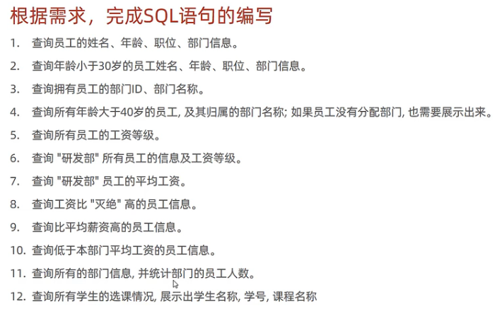

solution:
```mysql
# 1 隐式内连接
select e.name,e.age,e.job,d.name from emp e,dept d where e.dept_id = d.id;

# 2 显示内连接
#(select * from emp where age < 30);
select e.name,e.age,e.job,d.name from (select * from emp where age < 30) e join dept d on e.dept_id = d.id;

# 3
#select dept_id from emp;
select id,name from dept where id in (select dept_id from emp);
#另一种做法
select distinct d.id,d.name from emp e, dept d where e.dept_id=d.id;
# 4
#select * from emp where age>40;
select e.*,d.name from (select * from emp where age>40) e left join dept d on e.dept_id = d.id;
#另一种做法
select e.*,d.name from emp e left join dept d on e.dept_id = d.id where age>40;

# 5
select e.name,s.grade from emp e,salgrade s where e.salary between s.losal and s.hisal;

# 6
##########多表连接
#表emp,salgradem dept
#连接条件：emp.salary between s.losal and s.hisal ,emp.dept=dept.id
#查询条件：dept.name = "研发部"
select e.*,s.grade from emp e,dept d,salgrade s where e.dept_id=d.id and d.name="研发部" and (e.salary between s.losal and s.hisal);
#########子查询的方法
select e.*, s.grade from (select * from emp where dept_id = (select id from dept where name="研发部")) e, salgrade s where (e.salary between s.losal and s.hisal);
        
# 7
##########子查询
select avg(salary) from emp where dept_id = (select id from dept where name="研发部");
##########多表连接
#表：emp, dept
#连接条件 e.dept_id = d.id and d.name="研发部"
select avg(salary) from emp e,dept d where e.dept_id = d.id and d.name="研发部"；

# 8
#select salary from emp where name="灭绝";
select * from emp where salary>(select salary from emp where name="灭绝");

# 9
#select avg(salary) from emp;
select * from emp where salary > (select avg(salary) from emp);

# 10
# select mean(salary),dept_id from emp group by dept_id;
select e.* from emp e,(select avg(salary) a_s,dept_id from emp group by dept_id) s where e.dept_id = s.dept_id and e.salary < s.a_s;

# 11
#select dept_id,count(dept_id) from emp group by dept_id;
select d.*,d_e.dnum from dept d left join (select dept_id,count(dept_id) dnum from emp group by dept_id) d_e on d.id=d_e.dept_id;

# 12
# 表：student, crouse, student_crouse
# 连接条件：s.id = sc.studentid, c.id=sc.crouseid
select s.name,s.no,c.name from student s,crouse c, student_crouse sc where s.id = sc.studentid, c.id=sc.crouseid
```
## 3.6 总结

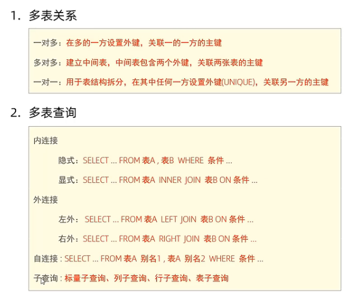

# 4. 事务

## 4.1 概述

**事务**是一组操作集合，它是一个不可分割的工作单位，事务会把所有操作作为一个整体一起向系统提交或撤销操作，即这些操作**要么同时成功，要么同时失败**

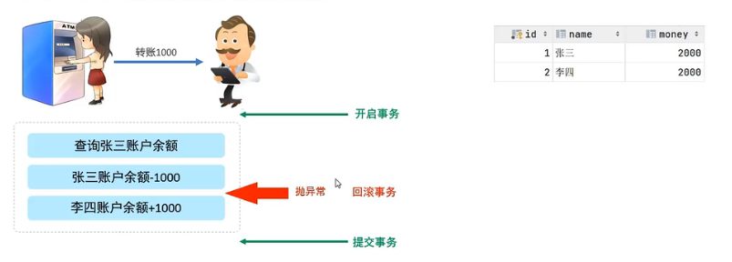

**默认MySQL的事务是自动提交的，即：当执行一条DML语句，MySQL会立即隐式提交事务**

## 4.2 事务操作

```mysql
# 创建账户余额
create table account(
	id int auto_increment primary key comment "主键id",
	name varchar(10) comment "姓名",
	money int comment "余额"
) comment "账户表";
# 插入数据
insert into account(id,name,money) values 
(null,"张三",2000) ,(null,"李四",2000);
########## ---------转账操作
# 1. 查询张三账户余额
select money from account where name="张三";
# 2. 将张三账户余额-1000
update account set money=money-1000 where name ="张三";
# 3. 将李四账户余额+1000
update account set money=money+1000 where name ="李四";

########### --------数据恢复
update account set money = 2000 where name in ("张三","李四");
```

1.1. 查看/设置事务提交方式
```mysql
SELECT @@autocommit; #自动提交 ,手动执行自动提交：SET @@autocommit = 1;
SET @@autocommit = 0; #手动提交事务，直到执行commit
```
1.2. 开启事务
```mysql
SET @@autocommit = 1; #手动执行自动提交
START TRANSACTION 或 BEGIN;
```
2. 提交事务（事务执行成功）
```mysql
COMMIT;
```
3. 回滚事务（事务执行失败）
```mysql
ROLLBACK;
```
## 4.3 事务四大特性(ACID)

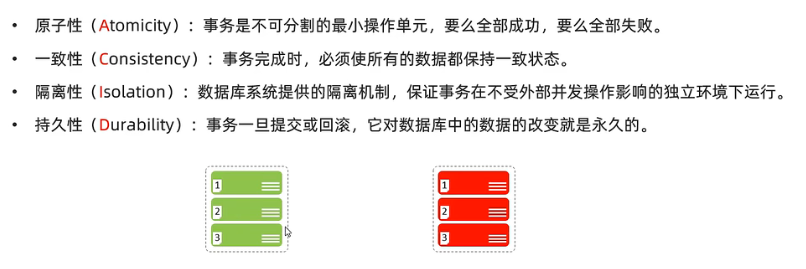

## 4.4 并发事务问题
|问题|描述|
|:--:|--|
|脏读|一个事务读到另一个事务还没有提交的数据|
|不可重复读|一个事务先后读取同一条记录，但两次读取的数据不同|
|幻读|一个事物按照条件查询数据时，没有对应的数据行，但是在插入数据时，又发现这行数据已经曾在，好像出现了“幻影”|

1. 脏读：事务B读取到了事务A还未提交的数据
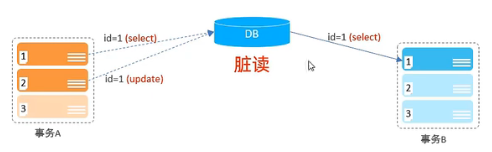
2. 不可重复读：事务A第一次查询之后，事务B更新数据并提交，当事务A第二次查询时，两次查询的结果不一致
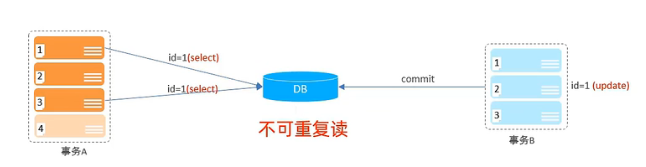
3. 幻读：在保证不可重复读时，事务A首先查询数据，并未查到，而事务B向数据中插入数据并提交，事务A尝试插入数据，发现数据已经存在，再次查询数据，仍然未查到（不可重复读），出现“幻读”。（id为主键）


## 4.5 事务的隔离级别
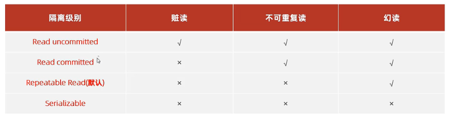

1. 查看事务隔离级别
```mysql
## @@表示查看系统变量
SELECT @@TRANSACTION_ISOLATION
```
2. 设置事务隔离级别
```MySQL
## session表示仅当前会话有效，global表所有会话
SET [SESSION|GLOBAL] TRANSACTION ISOLATION LEVEL [READ UNCOMMITTED| READ COMMITTED | REPEATABLE READ | SERIALIZABLE]
```

！！！**事务隔离级别越高，数据越安全，但是性能越低**
## 4.6 总结
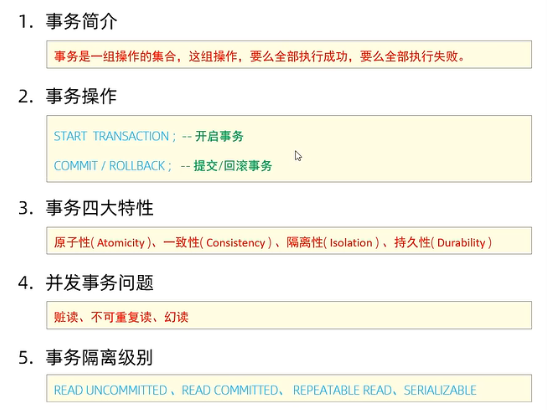