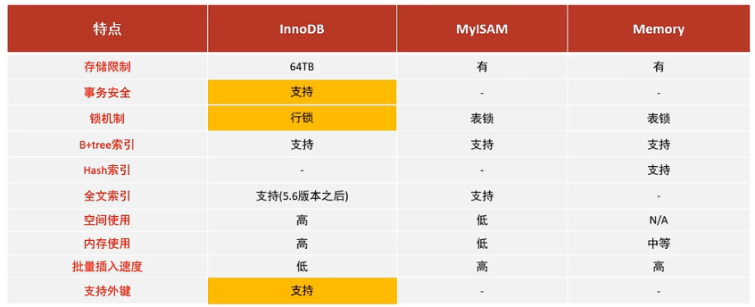

# 1. 存储引擎
## 1.1 MySQL体系结构


## 1.2 存储引擎简介

存储引擎是**存储数据、建立索引、更新/查询数据等技术的实现方式**。存储引擎是基于表的，而不是基于库的，所以存储引擎也可被视为表类型。
1. 默认存储引擎为InnoDB，下一个id为5，默认字符集为utf8mb4

2. 创建表时，指定存储引擎
```mysql
CREATE TABLE 表名(
	字段1 字段1类型 [comment 字段1注释],
	...
	字段n 字段n类型 [comment 字段n注释]
)ENGINE=INNODB [comment 表注释]
```
3. 查看当前数据库支持的存储引擎
```mysql
SHOW ENGINES;
```

## 1.3 存储引擎特点
### 1.3.1 InnoDB
+ 介绍
	InnoDB是一种兼顾高可靠性和高性能的通用引擎，是默认的MySQL存储引擎
+ 特点
	1. DML操作遵循ACID模型，支持**事务**
	2. **行级锁**，提高并发访问性能
	3. 支持**外键**FOREIGN KEY约束，保证数据的完整性和正确性
+ 文件
	+ xxx.ibd：xxx代表表名，innoDB引擎的每张表都会对应一个表空间文件，存储该表的表结构(frm，sdi)，数据和索引
	+ 参数：innodb_file_per_table

+ 查看系统变量状态，如果是on，表示每一张表对应一张表空间
```mysql
show variables like 'innodb_file_per_table';
```
在C——>program data ——> mysql ——> server 8.0 ——>data  ——> pratice
cmd ，>> ibd2sdi account.ibd
查看表结构


### 1.3.2 MyISAM

+ 介绍
	MyISAM是MySQL早期的默认存储引擎
+ 特点
	- 不支持事务，不支持外键
	- 支持锁表，不支持行锁
	- 访问速度快
+ 文件
	- xxx.sdi ：存储表结构信息
	- xxx.MYD：存储数据
	- xxx.MYI：存储索引
### 1.3.3 Memory
+ 介绍
	Memory引擎的表结构是存储在内存中的，由于收到硬件问题，或断电问题的影响，只能将这些表作为临时表或缓存表使用。
+ 特点
	- 内存存放
	- hash索引（默认）
+ 文件
	- xxx.sdi：存储表结构信息
### 1.3.4 存储引擎区别
InnoDB与MyISAM的区别：InnoDB支持事务，行锁，外键


## 1.4 存储引擎选择


## 1.5 总结


# 2. 索引
## 2.1 概述
+ 介绍
**索引**（index）是帮助MySQL**高效获取数据**的数据结构**（有序）**

！！！上述二叉树索引结构只是一个示意图，并不是真实的索引结构
## 2.2 索引结构
+ MySQL的索引是在存储引擎层实现的，不同的存储引擎有不同的结构
|索引结构|描述|
|:--:|--|
|B+Tree索引|$\textcolor{red}{最常见的索引类型，大部分索引都支持B+树索引}$|
|Hash索引|底层数据结构用hash表实现的，只有精确匹配索引列的查询才有效，不支持范围查询|
|R-tree(空间索引)|MyISAM引擎的一个特殊索引类型|
|Full-text(全文索引)|通过建立倒排索引，快速匹配文档的方式|


### 2.2.1树的索引结构

+ 二叉树缺点：顺序插入时，会形成一个链表，查询性能大大降低。大数据量情况下，底层较深，检索速度慢

+ 红黑树：解决了链表问题，但是在大数据量情况下，层级较深，检索速度慢

+ B-Tree($\textcolor{red}{多路}$平衡查找树)


[BTree演化过程](https://www.cs.usfca.edu/~galles/visualization/BTree.html)

+ B+Tree （4阶对应3个key，4个指针）

相对于B-Tree区别：
  - 所有的数据都会出现在叶子节点
  - 叶子节点形成一个单向链表
  - 非叶子节点仅起索引数据的作用，不存储数据

### 2.2.2 hash表
哈希索引采用一定的hash算法，将键值换算成新的hash值，映射到对应的槽位上，然后存储在hash表中
如果两个（或多个）键值，映射到一个相同的槽位上，就产生了hash冲突，可以通过链表解决
==特点==
  - Hash索引只能用于对等比较（=，in），不支持范围查询（between,>,<)
  - 无法利用索引完成排序操作
  - 查询效率高，通常只需要一次检索就可以了，效率通常高于B+Tree索引

==存储引擎支持==
  - Memory引擎支持Hash索引，而InnoDB中具有自适应hash功能，存储引擎根据B+Tree索引在指定条件下自动构建

### 2.2.3 总结


## 2.3 索引分类


在InnoDB存储索引中，根据**索引的存储**形式，分为


### 2.3.1 总结
当数据量为千万级别时，高度为3的B+Tree也能够存储，即最多两次索引即能查询到，效率高。（==B+Tree中非叶子节点仅做索引数据的功能，不存储数据，存储指针和键值==）


## 2.4 索引语法
+ 创建索引
```mysql
CREATE [UNIQUE|FULLTEXT] INDEX index_name ON table_name (index_col_name,...);
```
+ 查看索引
```mysql
SHOW INDEX FROM table_name [\G];#\G将表转化为行可视化
```
+ 删除索引
```mysql
DROP INDEX index_name ON table_name;
```

```mysql
# 1.创建常规索引
create index idx_user_name on tb_user(name);

# 2.创建唯一索引
create unique index idx_user_phone on tb_user(phone);

# 3.创建联合索引,字段顺序有讲究
create index idx_user_pro_age_sta on tb_user(profession,age,status);
# 4.
create index idx_user_email on tb_user(email);

# 5. 删除索引
drop index idx_user_email on tb_user;
```
## 2.5 SQL性能分析
+ SQL执行**频率**
```mysql
#查看服务器状态信息
SHOW [SESSION|GLOBAL] status;
# 查看当前数据库的INSERT,DELETE,UPDATE,SELECT的访问频率
SHOW GLOBAL STATUS LIKE 'Com______';#模糊匹配：一个下划线表示匹配单个字符
```
+ **慢查询日志**
  记录所有执行时间超过指定参数(long_query_time，单位：秒，默认10s)的所有SQL语句的日志

  存在地址->MySQL->..->Data->mysql
```mysql
SHOW VARIABLES LIKE 'slow_query_log';

#开启MYSQL慢查询日志开关
set global slow_query_log = 1
#设置慢日志之间为2秒，当SQL语句执行时间超过2秒，就被视为慢查询，记录慢查询日志
set long_query_time = 2;
```
+ ==profile==详情
```mysql
# 通过have_profiling参数，查看MySQL是否支持
select @@have_profiling;
# 默认profiling是关闭的，通过set语句在session/global级别开启profiling：
select @@profiling; # 查看
set profiling=1; # 设置

####------------执行一系列的业务SQL的操作，通过如下命令查看指令的执行耗时
# 查看每一条SQL的耗时情况
show profiles;
# 指定查看query_id的SQL语句各个阶段的耗时情况
show profile for query query_id;
# 查看指定query_id的SQL语句CPU的使用情况
show profile cpu for query query_id;
```
+ ==explain==执行计划
通过EXPLAIN/DESC命令**获取MySQL如何执行SELECT语句的信息**，包括在SELECT语句执行过程中表如何连接和连接的顺序
```mysql
# 在select语句之前加关键字explain/desc
EXPLAIN select 字段列表 from 表名 where 条件;
```

执行计划各字段含义
- id
  select查询的序列号，表示查询中执行select子句或者是操作表的顺序（id相同，执行顺序从上到下；id不同，值越大，越先执行）
- select_type
  表示SELECT的类型，常见取值有SIMPLE（简单表，即不使用表连接或子查询），PRIMARY（主查询，即外层的查询），UNION(union中的第二个或者后面的查询语句)，SUBQUERY（SELECT/WHERE之后包含的子查询）
- ==type==
  表示连接类型，性能由好到差的连接类型为NULL ,system ,const , eq_ref, ref ,range ,index, all
  - const：根据主键或唯一索引访问
  - ref：根据非唯一性索引访问
  - all：全表扫描
  - range：范围查询
- ==possible_key==
  - 可能应用在该表上的索引，一个或多个
- ==Key==
  - 实际使用的索引，如果为NULL，则没有使用索引
- ==Key_len==
  - 表示索引中使用的字节数，该值为索引字段最大可能长度，并非实际使用长度，在不损失精确性的前提下，长度越短越好
- rows
  - 执行查询的行数。在InnoDB引擎表中，只是一个估计值。
- filtered
  - 返回结果的行数占读取行数的百分比，值越大越好
- Extra
  - 未在前面展示出的信息在该列展示

## 2.6 索引使用

1. **验证索引效率**
未建立索引前，执行sql语句，查看sql耗时

```mysql
SELECT * FROM 表名 where sn=‘100000000021380’
```
针对字段创建索引，即根据索引数据创建B+树结构
```mysql
CREATE INDEX idx_sn ON 表名(sn);
```
再次执行相应的sql语句，再次查看sql的耗时
```mysql
SELECT * FROM 表名 where sn=‘100000000021380’
```
2. **最左前缀法则**
    如果索引了多列（联合索引），要遵循最左前缀法则。最左前缀法则指的是查询从索引的最左列开始，并且不跳过索引中的列。如果不存在最左键（只要求最左键存在，顺序无要求），则索引失效。如果跳跃某一列，==索引将部分失效（后面的字段索引失败）==

```mysql
# 创建联合索引，其中profession必须存在（最左键）
create index id_pro_age_sta on tb_user(profession, age, status);

# key_len = 54，符合最左前缀法则，且未跳过任何一列，索引生效
explain select * from tb_user where profession="软件工程" and age=31 and status='0';
# key_len = 49，符合最左前缀法则，索引生效，但status不走索引，其中status的索引长度为5
explain select * from tb_user where profession="软件工程" and age=31;
# key_len = 47，符合最左前缀法则，索引生效，但age，status不走索引，其中age字段的索引长度为2
explain select * from tb_user where profession="软件工程";
# 索引失效，不符合最左前缀法则，不包含profession
explain select * from tb_user where age=31 and status='0';
# 索引失效，不符合最左前缀法则
explain select * from tb_user where status='0';
# key_len = 47，符合最左前缀法则，但跳过了age，则status不走索引，只有profession生效，索引长度为47
explain select * from tb_user where profession="软件工程" and status='0';

# key_len = 54，符合最左前缀法则，且未跳过任何一列，索引生效，与索引排列顺序无关
explain select * from tb_user where age=31  and  status='0' and profession="软件工程";
```
### 2.6.1 索引失效情况
3. **范围索引**
联合索引中，出现范围查询(>,<)，$\textcolor{red}{范围查询右侧的列索引失效}$
```mysql
# status不走索引，key_len = 49
explain select * from tb_user where profession="软件工程" and age>31 and status='0';
# 联合索引生效，key_len = 54
explain select * from tb_user where profession="软件工程" and age>=31 and status='0';
```
4. **索引列运算**
不要在索引列上进行运算操作，$\textcolor{red}{索引将失效}$
```mysql
# phone具有唯一索引，截取后两位后索引失效
explain select * from tb_user where substring(phone,10,2) = ‘15；;
```
5. **字符串不加引号**
字符串类型字段使用时，不加引号，$\textcolor{red}{索引将失效}$
```mysql
# status不走索引，key_len = 49
explain select * from tb_user where profession="软件工程" and age>31 and status=0;
```
6. **模糊查询**
如果仅仅是尾部模糊查询，索引不会失效，但是头部模糊匹配时，$\textcolor{red}{索引将失效}$

```mysql
# key_len=47，profession走联合索引，且为最左键
explain select * from tb_user where profession like "软件%";
# 索引失效，进行全表扫描
explain select * from tb_user where profession like "%软件";
explain select * from tb_user where profession like "%软件%";
```

7. **or连接的条件**
用or分割开的条件，如果or前的条件中的列有索引，而后面的列中没有索引，那么涉及的索引都不会被用到
```mysql
# 索引失效，age不存在索引（联合查询中单根据age无法索引）
explain select * from tb_user where id=4 or age>31 ;
# create index id_user_age on tb_user(age);对age创建索引后，上面语句所有索引生效
```
8. **数据分布**

如果mysql评估使用索引比全表扫描更慢，则不使用索引

即mysql的索引条件查询的值占全表的比例较大，则不使用索引；比例较小时，使用索引#

### 2.6.2 索引使用规则

1. SQL提示

  是优化数据库的一个重要手段，即在SQL语句中加入一些人为的提示来达到优化操作的目的
  + use index：建议msql使用某个索引
```mysql
# 首先对profession创建单独索引和联合索引，建议单列索引，由mysql评估后选择
explain select * from tb_user use index(idx_user_pro) where profession="软件工程"
```
  + ignore index：忽略某个索引
```mysql
# 忽略单列索引
explain select * from tb_user ignore index(idx_user_pro) where profession="软件工程"
```
  + force index：强制mysql使用某个索引
```mysql
# 强制执行单列索引
explain select * from tb_user force index(idx_user_pro) where profession="软件工程"
```
2. 覆盖索引
尽量使用覆盖索引（查询使用了索引，并且需要返回的列，在该索引中已经全部能够找到）减少select \*（当需要返回的字段在索引列中不存在时，容易出现回表查询）
```mysql
explain select id,profession from tb_user where profession="软件工程" and age=31 and status='0';

explain select id,profession,age,status from tb_user where profession="软件工程" and age=31 and status='0';

explain select id,profession,age,status,name from tb_user where profession="软件工程" and age=31 and status='0';

explain select * from tb_user where profession="软件工程" and age=31 and status='0';
```
==using index condition：查找使用了索引，但是需要回表查询==
==using where, using index：查找使用了索引，但是需要的数据都在索引列中能找到，所以不需要回表查询==


3, 前缀索引
当字段类型为字符串（varchar,text）等时，有时候需要索引很长的字符串，会让索引变得很大，查询时浪费大量的磁盘ID，影响查询效率，此时可以$\textcolor{red}{只对字符串的一部分前缀，建立索引}$，可以大大节约索引空间，从而提高索引效率
  + 语法
```mysql
# 以前n个字符串作为索引
create index idx_xxxx on table_name (字段名(n));
```
  + 前缀长度
可以根据索引的选择性来决定，而选择性是指不重复的索引值（基数）和数据表的记录总数的比值，索引选择性越高则查询效率越高，唯一索引的选择性是1，这是最好的索引选择性，性能也是最好的
```mysql
select count(distinct substring(email,1,5))/count(*) from tb_user;
select count(distinct email)/count(*) from tb_user;
```

根据辅助（二次）索引查询到的i主键d值，回表查询得到对应的数据，然后与email进行匹配，由于辅助索引的叶子结点是链表，继续查询下一个满足条件的id对应数据，直到把所有数据均查询出来


4. 单列索引与联合索引


extra处，NULL表示进行了回表查询，上述仅采用了phone的单列索引，因此需要回表查询name对应的值

建立联合索引时，首先根据phone进行排序，当phone相同时，根据name进行排序


### 2.6.3 SQL语句优化案例

一张表有四个字段(id, username, password, status)，由于数据量大，需要对以下SQL语句进行优化，该如何进行才是最佳方案

```mysql
select id, username,password from tb_user where username='itcast';
```

+ 如果只对username建立单列索引，则需要先进行二次索引获取id值，然后进行聚集索引获取数据，即进行了回表查询，获取password的数据
+ 如果建立username和password的联合索引，则根据联合索引即可获得username,password对应的id值，只一次二次索引就获取了数据

## 2.7 索引设计原则

1. 针对数据量较大，且查询比较频繁的表建立索引
2. 针对常作为查询条件（where），排序（order by）,分组（group by）操作的字段建立索引
3. 尽量选择区分度高的列作为索引，尽量建立唯一索引，区分度越高，使用索引的效率越高
4. 如果是字符串类型的字段，字段的长度较长，可以针对于字段的特点，建立前缀索引
5. 尽量使用联合索引，减少单列索引，查询时，联合索引很多时候可以覆盖索引，节省存储空间，壁面回表，提高查询效率
6. 要控制索引的数量，索引并不是多多益善，索引越多，维护索引结构的代价也就越大，会影响增删改的效率
7. 如果索引列不能存储NULL值，请在创建表时使用NOT NULL约束它，当优化器知道每列是否包含NULL值时，他可以更好的确定哪个索引最有效地用于查询

## 2.8 总结


