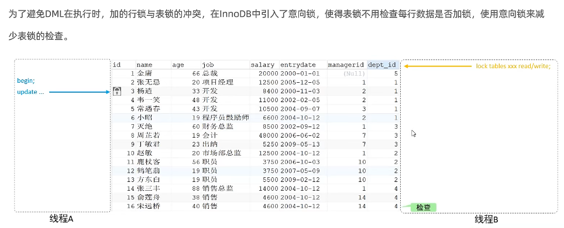

# 1. 锁

锁是计算机协调国歌进程或线程并发访问某一资源的机制。在数据库中，除传统的计算资源（CPU,RAM,I/O）的征用以外，数据也是一种供许多用户共享的资源。如何保证数据并发访问的一致性，有效性是所有数据库必须解决的一个问题，锁冲突也是影响数据库并发访问性能的一个重要因素。

锁对数据库而已显得尤其重要，也更加复杂

MySQL中，根据锁的粒度。分为以下三类

+ 全局锁：锁定数据库中的所有表
+ 表级锁：每次操作锁住整张表
+ 行级锁：每次操作锁住对应的行数据

## 1.1 全局锁

全局锁对整个数据库实例加锁，加锁后整个实例就处于只读状态，后续的DML,DDL语句，已经更新操作的事务提交语句都将被阻塞。

典型用作场景是做全库的逻辑备份，对所有表进行锁定，从而获取一致性试图，保证数据的完整性。


```mysql
# 给数据库加全局锁
flush tables with read lock;

# 在windows命令行中将数据写入磁盘文件
mysqldump -uroot -p mysql密码 itcast>itcast.sql

# 数据库备份完成后解锁
unlock tables;
```

==特点==

1. 在主库上备份，那么在备份期间都不能执行更新，业务基本得停摆

2. 在从库上备份，那么在备份期间从库不能执行主库同步过来得二进制日志（binglog），会导致主从延迟

   

在InnoDB引擎中，可以在备份时加上参数--single-transaction 参数来完成不加锁的一致性数据备份
```cmd
mysqldump --single-transaction -uroot -p123456 itcast>itcast.sql
```


## 1.2 表级锁

每次操作锁住整张表，锁定粒度大，发生锁冲突的概率最高，并发度最低。应用在MyISAM、BDB、InnoDB等存储引擎中

主要分为以下三类

1. **表锁**

   1. 表共享读锁：( read lock )

   2. 表独占写锁：( write lock )

      ```mysql
      # 加锁
      lock tables 表名... read/write
      
      # 释放锁
      unlock tables /客户端断开连接
      ```
      加读锁时，当前和其他客户端都可以进行读取，但是都无法进行修改
      
      
      加写锁时，当前客户端既能读也能写，但是其他客户端读写都不行
      
      
      
      $\textcolor{red}{读锁不会阻塞其他客户端的读，但是会阻塞写。写锁会阻塞其他客户端的读和写}$

2. **元数据锁**（meta data lock, MDL)

   MDL加锁过程是系统自动控制，在访问表时自动加上。MDL锁主要作用是维护元数据的数据一致性，在表上有活动事务的时候，不可以对元数据进行写入操作。$\textcolor{red}{为了避免DDL，DML冲突，保证读写的正确性}$

   当对一张表进行增删改查的时候，加MDL读锁（共享）；对表结构进行变更操作的时候，加MDL写锁（排他）

   

   ```mysql
   # 查看元数据锁， 在事务开启中间，记录增删改对应的元数据锁类型
   select object_type, object_schema, object_name,lock_type,lock_duration from performance_schema.metadata_locks;
   ```

3. **意向锁**

   

     1. 意向共享锁（IS）：与表锁共享锁（read）兼容，与表锁排他锁（write）互斥

     2. 意向排他锁（IX）：与表锁共享锁（read）及表锁排他锁（write）互斥。意向锁之间不会互斥

        ```mysql
        # 查看意向锁及行锁的加锁情况
        select object_schema, object_name,index_name,lock_type,lock_data from performance_schema.data_locks;
        ```

        ```mysql
        # 对id为1的行建立行锁以及意向共享锁
        select * from emp where id = 1 lock in share mode;
        # 与表锁共享锁（read）兼容，与表锁排他锁（write）互斥
        
        # 对id为1的行建立意向排他锁
        update emp set name="Russ" where id = 1;
        #则无法进行表锁共享锁和表锁排他锁
        ```

## 1.3 行级锁

每次操作所有对应的行数据。锁定粒度最小，发生锁冲突的概率最低，并发度最高。应用在InnoDB存储引擎中

InnoDB的数据是基于索引组织的，行锁是通过索引上的索引项加锁来实现，而不是记录加的锁。

分为三类

+ 行锁（Record Lock）：锁定单个行记录的锁，防止其他事务对此进行update和delete。在RC,RR隔离级别下都支持。RC：read commited, RR:Repeated read

    1. 共享锁（S）：允许一个事务去读一行，阻止其他事务获得相同数据集( 行 )的排他锁

    2. 排他锁（X）：允许获取排他锁的事务更新数据，阻止其他事务获得相同数据集的共享锁和排他锁


+ 间隙锁（Gap Lock）：锁定索引间隙（不含该记录，确保索引记录间隙不变，防止其他事务在这个间隙进行insert，产生幻读
+ 临建锁（Next-Key Lock）：行锁和间隙锁组合，同时锁住数据，并锁住数据前面的间隙Gap。在RR隔离级别下支持


==行锁，演示==

InnoDB在repeatable read事务隔离级别运行，使用next-key进行搜索和索引扫描，以防止幻读。

1. 针对唯一索引进行检索时，对已存在的记录进行等值匹配时，将会自动优化为行锁

2. InnoDB的行锁是针对于索引加的锁，不通过索引条件检索数据，那么InnoDB将对表中的所有记录加锁，此时会==升级为表锁==

   ```mysql
   ###########  查看意向锁及行锁的加锁情况
   select object_schema, object_name,index_name,lock_type,lock_data from performance_schema.data_locks;
   ```

==间隙锁/临建锁，演示==


$\textcolor{red}{间隙锁唯一目的是防止其他事务插入间隙。间隙锁可以共存，一个事务采用的间隙锁不会阻止另一个事务在同一个间隙上采用间隙锁}$

